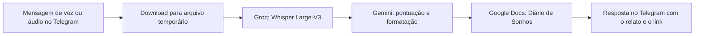

# Dreamlistener — Documentação técnica e funcional

## 1. Finalidade

O Dreamlistener recebe relatos de sonhos em áudio, transcreve e formata o texto, e o registra em um documento do Google Docs. O canal de uso em produção é um bot do Telegram. O repositório também contém scripts para processar uma pasta de áudios e para avaliar modelos de transcrição e de pós-processamento.

O projeto é distribuído sob a licença Apache 2.0, conforme o arquivo `LICENSE`.

## 2. Fluxos disponíveis

### 2.1 Bot do Telegram — fluxo de produção

O ponto de entrada é `app/bot.py`. O bot aceita mensagens de voz e arquivos de áudio enviados pelo Telegram.



O processamento ocorre assim:

1. O handler recebe mensagens filtradas como `VOICE` ou `AUDIO`.
2. O arquivo é baixado para um arquivo temporário com extensão `.ogg`.
3. `transcrever_audio_groq` envia os bytes para a API da Groq, usando o modelo `whisper-large-v3`, idioma `pt`, temperatura `0.0` e resposta em texto.
4. `refinar_texto_com_gemini` solicita apenas pontuação, parágrafos e remoção de ruídos de fala. O prompt pede preservação de vocabulário, primeira pessoa, nomes, lugares, ordem e conteúdo narrado.
5. O SQLite registra cada transição usando a identidade da mensagem do Telegram, evitando duplicação em retentativas.
6. Se o relato contiver uma referência simples de data que divirja da data de recebimento, o bot pausa, pede confirmação por botões e retoma a partir da transcrição salva.
7. `app.export_docs.publicar_sonho_no_docs` localiza ou cria o documento `Diário de Sonhos`, escolhe a guia da data confirmada e insere o relato.
8. O bot reconstrói o índice da primeira aba exclusivamente a partir dos sonhos publicados no SQLite.
9. O bot responde com o texto refinado e o link do Google Docs.

O comando `/start` explica esse uso ao usuário.

### 2.2 Refinamento com fallback do Gemini

O bot e o script de processamento em lote tentam, nesta ordem:

1. `gemini-3.6-flash`
2. `gemini-3.1-flash-lite`
3. `gemini-1.5-flash`

Para cada modelo, há até duas tentativas. Erros 429, 503, `RESOURCE_EXHAUSTED` ou `UNAVAILABLE` acionam espera antes de nova tentativa. No bot, as esperas são de 2 e 4 segundos; no script em lote, são de 3 e 6 segundos. Se nenhum modelo responder com texto, a operação termina com `RuntimeError`.

### 2.3 Registro no Google Docs

O módulo `app/export_docs.py` usa as APIs Google Docs e Google Drive. Ele procura um documento não enviado à lixeira com o título `Diário de Sonhos`; se não encontrar, cria um novo.

Cada data gera ou reutiliza uma guia cujo título está no formato `DD/MM/AAAA`. Um registro inclui:

- identificador recebido pelo chamador;
- horário de registro no formato `HH:MM`;
- texto refinado;
- divisor visual composto pelo caractere `⎯`.

A primeira guia é inicializada uma única vez com o título `📌 DIÁRIO DE SONHOS — ÍNDICE & ANÁLISES`. Atualmente, ela contém somente a introdução que reserva o espaço para futuros resumos, tags e sínteses; não há geração automática de índice ou análise implementada.

### 2.4 Processamento em lote

Os scripts em `benchmark/scripts/` suportam uma alternativa baseada em arquivos locais:

1. `1_transcrever.py` lê áudios de `data/raw_audios` quando a pasta existe; caso contrário, usa `audios`.
2. Ele transcreve apenas arquivos ainda ausentes no cache `data/json_caches/sonhos_brutos_whisper-large-v3.json`.
3. `2_refinar.py` lê esse cache, formata os itens ainda não marcados com `status_refinado`, grava um backup em `data/meus_sonhos.md` e publica no Google Docs.
4. Depois de publicar, o item recebe `status_refinado: true` no cache.

Os formatos aceitos nos dois fluxos são `.ogg`, `.opus`, `.mp3`, `.m4a` e `.wav`. Quando o nome segue o padrão do WhatsApp com data e hora, essa informação é extraída; em outros casos, o script de transcrição usa a data de modificação do arquivo.

### 2.5 Script local legado

`main.py` é um fluxo separado, baseado em `faster-whisper` executado localmente com o modelo `medium` em CPU e `int8`. Ele usa os caminhos relativos `audios`, `meus_sonhos_processado.md` e `processados.txt`. Depois da transcrição local, chama o Gemini sem a cascata de fallback presente no bot.

Esse arquivo não é chamado pelo `Procfile` e não é o fluxo usado pelo bot do Telegram.

## 3. Componentes do repositório

| Caminho | Responsabilidade |
| --- | --- |
| `app/bot.py` | Bot do Telegram, download temporário, transcrição Groq, refinamento Gemini e resposta ao usuário. |
| `app/export_docs.py` | OAuth do Google, busca/criação do diário, guias por data e inserção de relatos. |
| `benchmark/scripts/1_transcrever.py` | Transcrição em lote com a Groq e persistência do texto bruto em JSON. |
| `benchmark/scripts/2_refinar.py` | Refinamento em lote, backup Markdown e publicação no Google Docs. |
| `benchmark/scripts/3_validar_modelos.py` | Benchmark local de modelos Whisper com WER, CER e tempo. |
| `benchmark/scripts/4_validar_pos_processamento_llm.py` | Geração de métricas comparativas; a implementação atual usa o texto bruto também como texto refinado. |
| `benchmark/scripts/5_variabilidade_llm.py` | Avaliação de variabilidade do Gemini em três execuções por áudio. |
| `benchmark/reports/` | Relatórios Markdown de benchmarks já executados. |
| `docs/EVALUATION.md` | Descrição dos benchmarks ASR, métricas e decisões registradas. |
| `docs/Procfile` | Comando de execução do worker: `python -m app.bot`. |
| `requirements.txt` | Dependências Python fixadas por versão. |

## 4. Configuração necessária

O bot exige estas variáveis no ambiente antes de iniciar:

| Variável | Uso |
| --- | --- |
| `TELEGRAM_BOT_TOKEN` | Autenticação do bot do Telegram. |
| `GROQ_API_KEY` | Transcrição de áudio pela Groq. |
| `GEMINI_API_KEY` | Refinamento dos relatos pelo Gemini. |
| `ALLOWED_TELEGRAM_CHAT_IDS` | Lista obrigatória de chats autorizados, separada por vírgulas. Com valor ausente, o bot recusa todos os chats. |

O módulo de Google Docs usa os arquivos `credentials.json` e `token.json` na raiz. O primeiro é usado para iniciar o OAuth quando não há uma sessão válida; o segundo armazena a credencial autorizada e pode ser renovado pelo módulo. Os escopos solicitados são `documents` e `drive.file`.

Se o Google revogar ou rejeitar a renovação do token, o bot não pede
consentimento no Telegram e não reenvia áudio ou texto ao Gemini. Ele mantém o
registro em `refined`, avisa a pessoa usuária e ela deve, no computador em que
o bot roda, executar:

```bash
python -c "from app.export_docs import reautorizar_google; reautorizar_google(); print('Autorização concluída.')"
```

Após concluir a tela de consentimento no navegador e reiniciar `python -m
app.bot`, o comando Telegram `/retomar_publicacoes` publica os textos pendentes.
Também reconhece registros da versão anterior que tenham falhado somente em
`publicação no Google Docs`; outras falhas não são retomadas automaticamente.

O arquivo `.env` é carregado por `python-dotenv`. Ele e arquivos `.json`, áudios e extensões de mídia estão ignorados pelo Git conforme `.gitignore`; portanto, não fazem parte dos arquivos versionados avaliados nesta documentação.

Para instalar as dependências declaradas:

```bash
python -m pip install -r requirements.txt
```

Para executar o bot:

```bash
python -m app.bot
```

## 5. Persistência e dados

| Dado | Local | Finalidade |
| --- | --- | --- |
| Registro estruturado | `data/dreamlistener.db` | Fonte de verdade para identidade, estado, transcrições, URL e falhas do processamento. Armazena também a data do sonho, sua origem e confirmações pendentes. Arquivo local ignorado pelo Git. |
| Áudio temporário do bot | Diretório temporário do sistema | Existe somente durante o processamento e é removido ao final, inclusive em falhas. O projeto não arquiva uma cópia local persistente do áudio. |
| Áudios para lote | `data/raw_audios/` ou `audios/` | Fonte do processamento em lote. |
| Cache de transcrições | `data/json_caches/sonhos_brutos_whisper-large-v3.json` | Evita nova transcrição do mesmo nome de arquivo e guarda `status_refinado`. |
| Backup de relatos | `data/meus_sonhos.md` | Cópia local produzida pelo script de refinamento em lote. |
| Diário principal | Google Docs, título `Diário de Sonhos` | Destino dos relatos publicados. |

O arquivo temporário do bot é removido no bloco `finally`; por isso, também é
descartado quando uma etapa de download, transcrição, refinamento ou publicação
falha.

## 6. Observabilidade e tratamento de falhas

`app/bot.py` configura logs no nível `INFO`. As tentativas e falhas de modelo
Gemini são registradas. Os eventos de início, duplicação, publicação e falha
incluem o UUID interno do sonho para correlação, sem registrar transcrições ou
textos refinados. Erros não recuperáveis durante o processamento são registrados
com stack trace e o usuário recebe uma mensagem genérica para tentar novamente.

O fluxo do bot persiste a identidade da mensagem do Telegram no SQLite e evita
duplicação por uma chave única de origem, conversa e mensagem. Uma autorização
OAuth expirada é uma pausa recuperável: o texto refinado fica disponível para
`/retomar_publicacoes` depois de um novo consentimento local. Falhas em outras
etapas não entram nessa retomada automática. No lote, a prevenção contra
reprocessamento segue baseada no nome do arquivo no cache JSON e na marca
`status_refinado`.

O índice do Google Docs é uma projeção eventual: uma falha ao atualizá-lo não
desfaz uma publicação já registrada. Uma execução posterior pode reconstruí-lo a
partir dos registros publicados no SQLite.

Após o refinamento, o bot atribui tags factuais por uma taxonomia determinística
de palavras observáveis, como `agua`, `casa`, `familia` e `trabalho`. Essas tags
não expressam significados psicológicos e podem filtrar somente sonhos publicados.

O comando `/buscar` faz recuperação estruturada sem LLM e sem RAG. Ele aceita
texto livre, `tag:<nome>`, `de:AAAA-MM-DD` e `ate:AAAA-MM-DD`, em qualquer
combinação, e devolve no máximo cinco sonhos publicados com data, tags, trecho
curto e link. Exemplos: `/buscar rio`, `/buscar tag:agua` e `/buscar
de:2026-09-01 ate:2026-09-30 tag:casa`. A mesma allowlist que protege a
ingestão também protege essa leitura.

O menu nativo do Telegram lista `/start`, `/ajuda`, `/buscar` e
`/retomar_publicacoes`. Os comandos também são explicados nas mensagens de
boas-vindas e ajuda, para que o uso não dependa de memorizar atalhos.

## 7. Benchmark e resultados registrados

`3_validar_modelos.py` avalia `medium`, `large-v3-turbo` e `large-v3` com `faster-whisper` em CPU. Cada modelo é executado em um processo filho para liberar a memória ao final da execução. As métricas são WER, CER, tempo e acurácia calculada como `1 - WER`.

O relatório versionado `benchmark/reports/benchmark_relatorio.md`, datado de 21/08/2026, registra:

| Modelo | Tempo médio por áudio | WER global | CER global | Acurácia global |
| --- | ---: | ---: | ---: | ---: |
| `medium` | 204,96 s | 50,22% | 21,64% | 49,78% |
| `large-v3-turbo` | 198,03 s | 32,30% | 14,94% | 67,70% |
| `large-v3` | 253,86 s | 29,54% | 15,01% | 70,46% |

Há relatórios adicionais para WER antes/depois, BERTScore e repetibilidade do Gemini. Eles registram resultados de execuções anteriores, mas não devem ser interpretados como uma reprodução garantida do estado atual do código. Em especial, `4_validar_pos_processamento_llm.py` contém uma função que retorna o próprio texto bruto como `texto_refinado`; ele não chama a API Gemini nem carrega um cache refinado nesta versão.

## 8. Limites atuais verificáveis

- Há testes unitários versionados para a camada SQLite; ainda não há testes de integração com APIs externas.
- Não há configuração de plataforma de deploy, além de `docs/Procfile` com o comando de worker.
- O bot registra a entrada antes de chamar serviços externos e não duplica uma mensagem do Telegram já registrada.
- O bot remove o áudio temporário no bloco `finally`, inclusive quando a transcrição ou uma etapa posterior falha.
- O Dreamlistener não persiste cópias locais de áudios enviados pelo Telegram; essa política não exclui a mensagem original da conta do Telegram.
- O identificador publicado pelo bot é `Voz_<message_id>` e a identidade completa da mensagem de origem é persistida no SQLite.
- O relatório HTML navegável, o agente analítico, o agente junguiano e a geração automática de índice são itens do backlog e não estão implementados.
- Os scripts de benchmark usam caminhos relativos distintos dos caminhos usados pelos scripts de lote; sua execução depende do diretório de trabalho e da presença dos arquivos esperados.

## 9. Execução e responsabilidade operacional

O comando de worker disponível é:

```text
worker: python -m app.bot
```

O bot usa `run_polling`, portanto consulta atualizações do Telegram enquanto o processo permanece ativo. A documentação do repositório não define provedor de hospedagem, processo de deploy, monitoramento externo ou política de retenção dos relatos no Google Docs.
